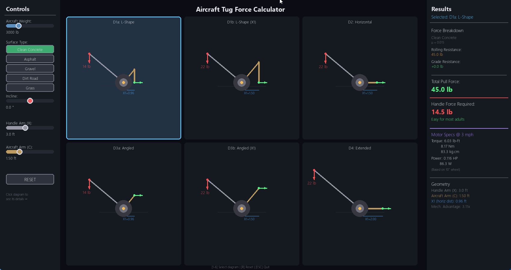

# Physics Simulation Tools

Built to settle an ~~argument~~ *friendly discussion* with a friend about lever mechanics and aircraft tug forces. You know how it goes—someone says "that's not how physics works" and suddenly you're building interactive simulations at 2am to prove a point.

Worth it? Absolutely.



## What's Inside

### `lever_sim_orig.py` - Lever Torque Simulator

Interactive simulation showing how lever arms work. Five different configurations demonstrating that **F2 = F1 × C / X1** isn't just textbook nonsense—it's real.

Features:
- 5 lever diagrams with different arm configurations (L-shaped, horizontal, angled)
- Adjustable F1 force, arm lengths via sliders
- Real-time torque calculations
- Watch the lever tip when forces are unbalanced
- Color-coded panels showing which configurations produce equal F2 values

### `aircraft_tire_tug_sim.py` - Aircraft Tug Force Calculator

Ever wondered how much force it takes to push a 3000 lb aircraft? Neither did I until this discussion happened.

Calculates:
- **Handle force required** (how hard YOU push down)
- **Motor specs** if you're lazy and want a motorized tug (torque in lb-ft, Nm, kg.cm)
- Rolling resistance based on surface type
- Grade resistance for inclines

Features:
- 6 lever arm configurations to compare
- Surface presets: Clean Concrete, Asphalt, Gravel, Dirt Road, Grass
- Incline slider (-2° to +2°)
- Click any diagram to see its detailed breakdown
- Tells you if a human can actually do it or if you need a motor

## Installation

```bash
pip install -r requirements.txt
```

## Usage

```bash
# Lever physics simulation
python lever_sim_orig.py

# Aircraft tug calculator
python aircraft_tire_tug_sim.py
```

## Controls

Both simulations:
- **Drag sliders** to adjust values
- **[R]** Reset everything
- **[ESC]** Quit

Tug Calculator specific:
- **Click diagrams** to select and see detailed results
- **[1-6]** Quick select diagram

## The Physics (for the curious)

**Lever Mechanics:**
```
Torque = Force × Distance from pivot
F2 = F1 × C / X1
```

**Tug Forces:**
```
Rolling Resistance = μ × Weight × cos(θ)
Grade Resistance = Weight × sin(θ)
Handle Force = Pull Force × C / X
```

## Requirements

- Python 3.8+
- Pygame 2.5.0+

## License

Do whatever you want with it. If it helps you win your own physics argument, I consider that a success.

---

*The friend was right, by the way..*
